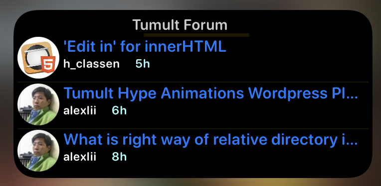
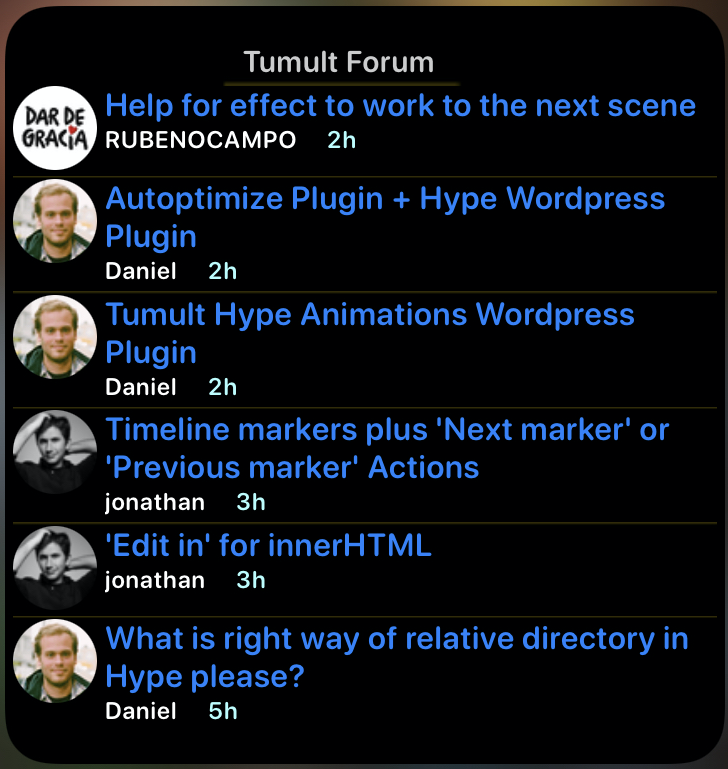

# Tumult Hype latest Post iOS Widget
 A widget created  with Scriptable for **Tumult Hype Forum** latest posts

|                          Small                           |                         Medium                         |                          Large                           |
| :------------------------------------------------------: | :----------------------------------------------------: | :------------------------------------------------------: |
|  |  |  |

This  widget  was created with [Scriptable](https://scriptable.app ) and is designed to show the latests user posts on the Tumult Hype Forum Site.

The Forum is powered by DISQUS. Which also powers many other forums.

It should be relatively easy to adapt to other DISQUS powered fora, like the   [Automators ](https://talk.automators.fm) forum which hosts a Scriptable category and where I spents some time threading through the posts. ( check it out)

Note  though that the json files and their corresponding tree structure  and name keys may differer on other Disqus powered sites.

  ***Scriptable*** is a free app on the AppStore that allows you to write and automate using Javascript on your iOS devices. 

#### Setup on iOS Device

The scriptable js file needs to be added to you scriptable list. You can simple drop the file into your iCloud's ***Scriptable*** folder on your Mac, or via files.app on your device.

Select a Scriptable Widget on your devices (iOS 14+)

Choose the Script file.

In the **Parameter** field; enter either **small**, **medium** or **large**, depending on which size widget you have chosen.

Hit done. Thats it.

#### Usage

**From the widget.**

Each post when touched will take you to the post in the thread.

The Tumult header when touched will take you to the Tumult main page and topic list.

Remember widgets do not show fully dynamic data. They are snap shots and update periodically 

**From  shortcuts , scriptable etc..**

There is a **Table**  view presentation (sheet ).

The Table view for the posts, is in fact the original idea ( and inspiration for this widget ) of @MaxZieb, another user of the forums, who also introduced us to Scriptable at the same time.

I have partially updated the Table's code to use the current data.

------

The code has comments.

There are two json trees in use from the json file data.

 **users** and **topic_list**

 The users **id** is in the topic list along with most of the other needed data, including post id and url

 The user id is then searched for in the users tree to find the users image.

