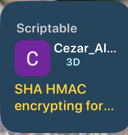
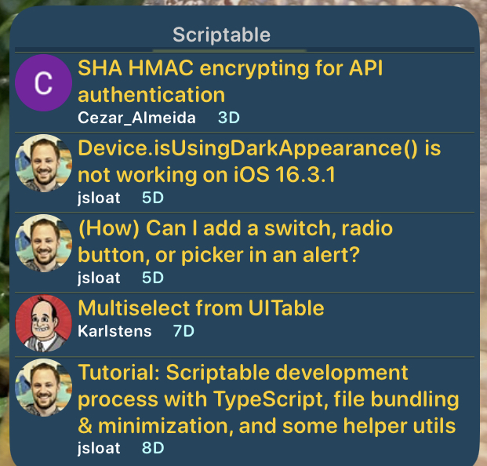
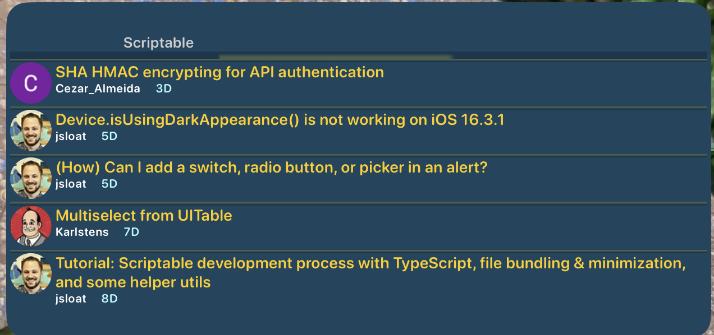
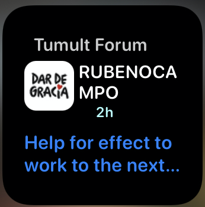
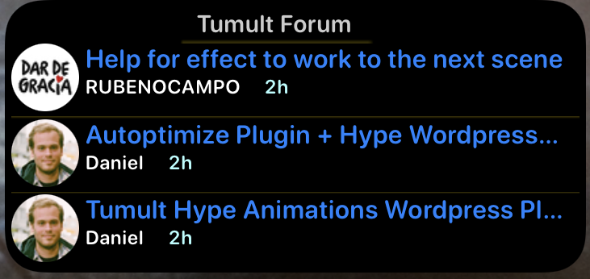
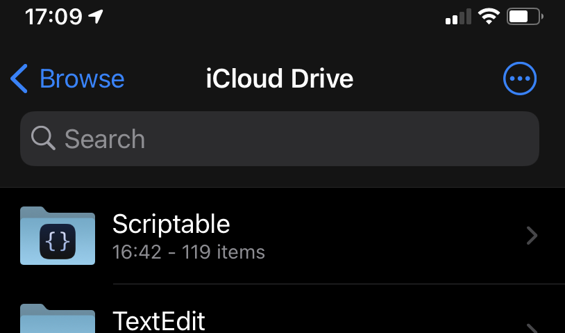
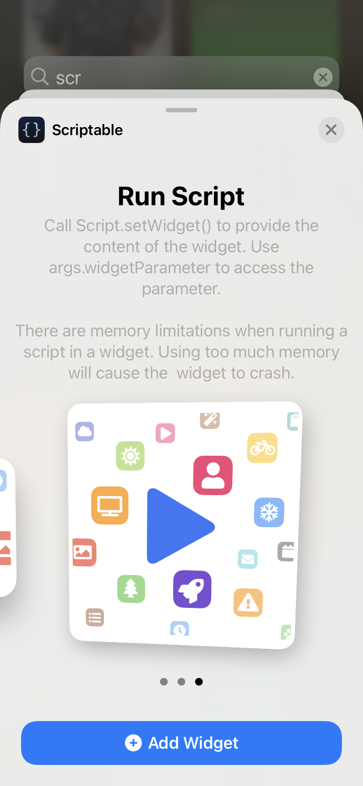
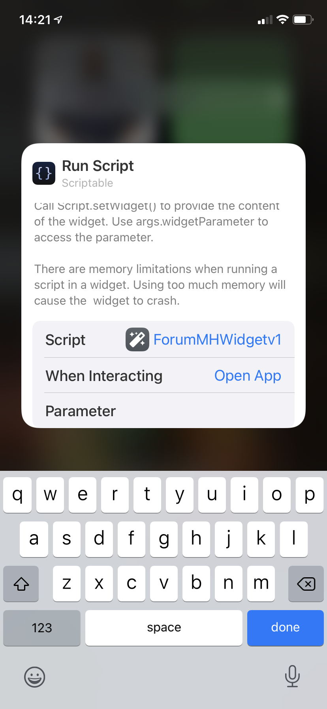

# Discourse Forum latest Post iOS Widget

 A widget created  with Scriptable.app for iOS to display the latest Discourse Forum Posts: 

Two examples.

Example 1

**Scriptable  Forum 2.js** file

  **Scriptable**'s Forum Latest posts held on   [Automators.fm](https://talk.automators.fm/c/scriptable/13) 

| Small                                                        | Medium                                                       | Large                                                        |
| ------------------------------------------------------------ | ------------------------------------------------------------ | ------------------------------------------------------------ |
|  |  |  |

---

Example 2

**Tumult Forum 2.js**  file

   **Tumult Hype**  [<b>Forums</b> ](https://forums.tumult.com)  Latest posts 

|                           Small                           |                         Medium                          |                           Large                           |
| :-------------------------------------------------------: | :-----------------------------------------------------: | :-------------------------------------------------------: |
|  |  |  |

+ Plus  a bonus  **Discourse Forum 2.js** script for the Discourse forums itself.

  

These  widgets  ( **Tumult Forum 2.js** ,  **Scriptable  Forum 1.js** & **Discourse Forum 2.js** ) where created with [Scriptable](https://scriptable.app ) and are designed to show the latests user posts on the  a Forum Site.

The Forums are powered by  Which also powers many other forums.

It should be relatively easy to adapt to other [Discourse](https://www.discourse.org) powered fora, like the two examples which include      [Forums ](https://talk.automators.fm) which hosts a **Scriptable** category and where I spents some time threading through the posts. ( check it out)

Note  though,  the json files and their corresponding tree structure  and name keys may differer on other Discourse powered sites and you may need to re mapped them.

  ***Scriptable*** is a free app on the AppStore that allows you to write and automate using Javascript on your iOS devices. 

---

## General code edit to be done for adaption

*Tip:  The Scriptable script folder will be in your iCloud/ Files. Which means you can do the edits using an editor on your Mac and then  run on your iOS device once synced.*

`var removeFirstEntry  = false` 

Change to true if you need/want to remove the first entry. This may be because it is a Sticky "About category entry"

---

Change these constants to point to the latest json url.

`const forumURL = "https://talk.automators.fm"` 
`const url = forumURL+"/c/scriptable/13.json"`

The json file may be named something different, examing the Network panel in the Browser's inspector to find it and then its url path.  You should be able to  remove the query string:

`https://talk.automators.fm/c/scriptable/13.json?page=1`

The file is **13.json**

It may not show up straight away in the network asset list. if not scroll the posts in the browser and it will re request when it lazy loads the next set of posts.

We then remove the query string ?page=1

The code should be able to filter out the Latest posts.

---

Another  example would be

`const forumURL = "https://forums.tumult.com"`
`const url = forumURL+"/latest.json"`

---

Change these constants to your own desired colours and forum name at top.

const widget_forum_heading = "Scriptable"`

`const widgetBG =   new Color("#1C4560")`
`const widgetTitleColor = new Color("#CCCCCC", 1)`
`

`const widgetTextColor  = Color.yellow()` 
`const userNameTextColor = Color.white()`

#### Setup on iOS Device

The scriptable js file needs to be added to you scriptable list. You can simple drop the file into your iCloud' Drive's ***Scriptable*** folder on your Mac or via files.app on your device.

|                                                              |                                                              |
| ------------------------------------------------------------ | ------------------------------------------------------------ |
|  |  |

Once the files is on your device (should sync via iCloud from device to device)

Select a Scriptable Widget on your devices (iOS 14+)  Using the Add new widget on the Home Screen.

Choose the new Script file ( for example **ForumMHWidgetv1.js**)  ~~and  in the **Parameter** field; enter either **small**, **medium** or **large**, depending on which size widget you have chosen.~~

The size of the widget will determine the type of display.

***Small*** will display a single latest post, ***Medium*** the top three latest posts and the ***Large*** will display the top six.

(ForumMHWidgetv1 is the original name I used for my script ) the two new examples will be named  **Scriptable  Forum 1.js** & **Tumult Forum 2.js** 

But you can name yours what ever you want )

|                                                              |                                                              |
| ------------------------------------------------------------ | ------------------------------------------------------------ |
|  |  |

 Hit **done**. Thats it.

Dont worry about changing the 'When interacting' that is overridden in the script.

#### Usage

**From the widget.**

Each post when touched, will take you to the post entry in the thread.

The Tumult header when touched will take you to the Tumult main page and topic list.

Remember widgets do not show fully dynamic data. They are snapshots and update periodically 

**From  shortcuts , scriptable etc..**

Scriptable files can also be run from iOS Shortcuts.app

There is a **Table**  view presentation (sheet ) mainly for when used this way.

The Table view for the posts, is in fact the original idea ( and inspiration for this widget ) of @MaxZieb, another user of the forums, who also introduced us to Scriptable at the same time.

I have partially updated the Table's code to use the current data.

------

*The code mostly has comments.*

There are two json trees in use from the json file data.

 **users** and **topic_list**

 The users **id** is in the **topic** list along with most of the other needed data, including post id and url

 The user id is then searched for in the **users** tree to find the users image.

|                    **topic_list**/topics                     |                          **users**                           |
| :----------------------------------------------------------: | :----------------------------------------------------------: |
|  |  |

 

